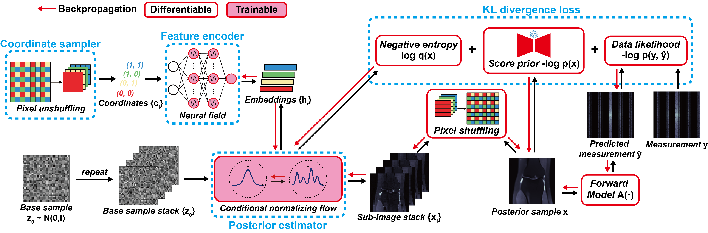

# [ICCP 2026] ShuffleFlow: Scalable Posterior Inference for Bayesian Inverse Imaging

<b>[Tianao Li](https://lukeli0425.github.io)</b><sup>1,3</sup>, <b>[Tjitske Starkenburg](https://tstarkenburg.github.io/)</b><sup>1,3</sup>, <b>[Yu Sun](https://sunyumark.github.io/)</b><sup>2</sup>, <b>[Emma Alexander](https://www.alexander.vision/)</b><sup>1,3</sup><br>
<sup>1</sup>Northwestern University, <sup>2</sup>Johns Hopkins University, <sup>3</sup>NSF-Simons AI Institute for the Sky (SkAI)<br>
_IEEE International Conference on Computational Photography (ICCP), 2026_

[](https://nubivlab.github.io/ShuffleFlow/)&nbsp;
[](https://arxiv.org/abs/2606.21099)&nbsp;
[](./LICENSE)&nbsp;

Official code for [_ShuffleFlow: Scalable Posterior Inference for Bayesian Inverse Imaging_](https://nubivlab.github.io/ShuffleFlow/).




---

## Overview

This repository supports two inference modes:

| Mode | Entry point | Description |
|---|---|---|
| **Variational Inference (VI)** | `vi_ddp.py` | Trains a normalizing flow per test image to approximate the posterior via alpha-divergence minimization |
| **Posterior Sampling** | `ps_ddp.py` | Runs diffusion-based samplers (DAPS, DPS, PnP-DM, …) using a pretrained score model |

Both modes use multi-GPU DDP via `torchrun` and [Hydra](https://hydra.cc) for config composition.
The structure of this repository is built upon [InverseBench](https://github.com/devzhk/InverseBench).

---

## Installation

```bash
git clone https://github.com/NUBIVLab/ShuffleFlow.git
cd ShuffleFlow
pip install -r requirements.txt
```

---

## Usage

All Hydra config keys can be overridden on the command line. 
### 1. Generate preprocessed test data

```bash
python generate_data.py inverse_problem=single-coil_mri
# or: inverse_problem=motion_deblur, phase_retrieval
```

### 2. Train a diffusion prior

```bash
torchrun --standalone --nproc_per_node=gpu train.py \
    model=vp_ncsnpp_256 \
    inverse_problem=single-coil_mri
```

Checkpoints are saved to `saved_models/diffusion/<dataset>/<model_name>/`.

### 3. Run variational inference (ShuffleFlow)

```bash
HYDRA_FULL_ERROR=1 torchrun --standalone --nproc_per_node=gpu vi_ddp.py \
    inverse_problem=single-coil_mri \
    flow=shuffleflow \
    inverse_problem.dataset.idx_list=0-4
```

Common overrides:

```bash
flow.network_config.downsample=8   # spatial block size
flow.network_config.shuffle_flows=8
flow.loss_config.alpha=1.0         # alpha-divergence order
n_epochs=5000
```

### 4. Run posterior sampling

```bash
HYDRA_FULL_ERROR=1 torchrun --standalone --nproc_per_node=gpu ps_ddp.py \
    model=vp_ncsnpp_256 \
    inverse_problem=single-coil_mri \
    sampler=daps
```

Available methods: `daps`, `dps`, `pnp-dm`, `score-ald`, `diffusion`, `ald-tv`, `red-diff`, `rml-tv`, `score-mri`, `wiener`.

---


## Citation
```bibtex
@inproceedings{li2026shuffleflow,
  title={ShuffleFlow: Scalable Posterior Inference for Bayesian Inverse Imaging},
  author={Li, Tianao and Starkenburg, Tjitske and Sun, Yu and Alexander, Emma},
  booktitle={IEEE International Conference on Computational Photography (ICCP)},
  year={2026},
  organization={IEEE}
}
```

## Acknowledgements

We gratefully acknowledge the support of the [NSF-Simons AI Institute for the Sky (SkAI)](https://skai-institute.org) via grants NSF AST-2421845 and Simons Foundation MPS-AI-00010513. This material is based upon work supported by the U.S. National Science Foundation under Award No. 2542022. The authors would like to thank [Bryan Pardo](https://bryan-pardo.github.io/), [He Sun](https://hesunpu.github.io/), and [Yi-Chun Hung](https://yichunhung.github.io/) for helpful discussions.